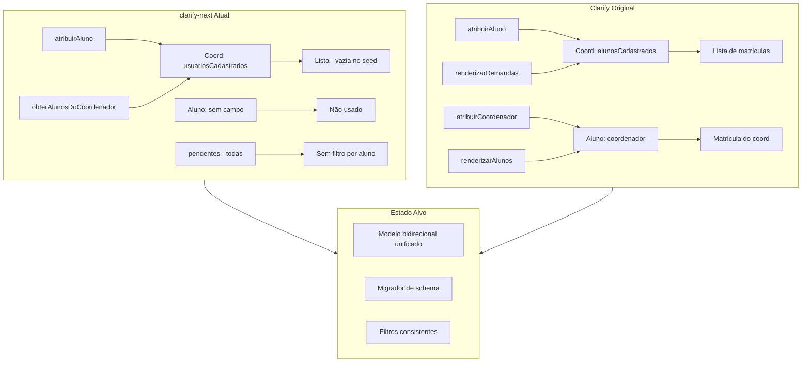

# Planejamento: Comparação Clarify (Vanilla) × clarify-next (React + Next + TS)

> **Data:** 10/06/2026  
> **Objetivo:** Auditar a transcrição do Clarify original para o clarify-next, identificar falhas, erros de lógica e propor correções/refatorações priorizadas.

---

## 1. Resumo executivo

O **clarify-next** reproduz a estrutura geral do Clarify (rotas, localStorage, fluxos de login/registro, central de demandas e dashboard do coordenador), mas apresenta **divergências críticas no modelo de dados de vínculo coordenador↔aluno** e **filtros do dashboard do coordenador** que quebram o comportamento esperado com os dados seed e em uso real.

A migração arquitetural (SPA manual → App Router + React + hooks) está bem encaminhada, porém há **gaps de paridade funcional e visual** relevantes — especialmente no dashboard coordenador, nos dados iniciais e na landing page.

| Área | Status geral |
|------|-------------|
| Autenticação (login/logout) | ✅ Equivalente |
| Registro de coordenador | ⚠️ Lógica similar, implementação divergente |
| Central de demandas (aluno) | ⚠️ Funcional, com gaps de UI |
| Dashboard coordenador | ❌ Filtros e vínculos incorretos |
| Turmas | ✅ Equivalente |
| Landing page | ⚠️ Versão simplificada |
| Modelo de dados (localStorage) | ❌ Incompatível parcialmente |

---

## 2. Mapa de equivalência (arquivos)

| Clarify (Vanilla) | clarify-next | Observação |
|-------------------|--------------|------------|
| `main.js` | `app/layout.tsx` + `Initializer.tsx` | Seed condicional vs overwrite total |
| `lib/navegacaoURL.js` | App Router + `(dashboard)/layout.tsx` | Proteção por cargo implementada |
| `lib/funcoesAuxiliares.js` | `lib/auth.ts` + `lib/localStorage.ts` + `lib/utils.ts` | Funções divididas; faltam algumas |
| `lib/funcoesAuxiliares.js` (demandas) | `lib/demandas.ts` | CRUD expandido com tipos |
| `pages/login.js` | `app/login/page.tsx` | Logo errado (`/next.svg`) |
| `pages/registro.js` | `app/registro/page.tsx` | Não usa `registrarCoordenador` |
| `pages/landing.js` | `app/page.tsx` | Conteúdo reduzido |
| `pages/centralDemandas.js` | `app/(dashboard)/centraldemandas/page.tsx` + `components/demandas/*` | Views renomeadas (`inicio` → `nome`) |
| `pages/dashboardcoord.js` | `app/(dashboard)/dashboardcoord/page.tsx` + `components/coord/*` | Lógica de filtro divergente |
| `services/demands.js` | Componentes + hooks | Lógica inline nos componentes |
| `services/turmas.js` | `hooks/useTurmas.ts` + `ModalCriarTurma.tsx` | Equivalente |
| `components/structures/modais.js` | `ModalNovaDemanda.tsx` + `ModalDetalhesDemanda.tsx` | Bem transcrito |
| `components/structures/sidebar.js` | `components/layout/Sidebar.tsx` | Equivalente |
| `components/structures/topbar.js` | `UserChip.tsx`, `TopbarMobile.tsx` | `TopbarDesktop` existe mas não é usado |
| `data/demanda.js`, `data/usuarios.js` | Não usados | Mock inline em `localStorage.ts` |

---

## 3. Matriz de paridade funcional

| Funcionalidade | Clarify | clarify-next | Paridade |
|----------------|---------|--------------|----------|
| Login com redirecionamento por cargo | ✅ | ✅ | ✅ |
| Registro com chave de ativação | ✅ | ✅ | ⚠️ |
| Seed de usuários/demandas de teste | ✅ (sempre sobrescreve) | ✅ (só se vazio) | ⚠️ |
| Vínculo coord ↔ alunos no seed | ✅ `alunosCadastrados` + `coordenador` | ❌ Campos ausentes | ❌ |
| Aluno cria demanda (título livre) | ✅ | ✅ | ✅ |
| Aluno filtra/busca demandas | ✅ | ✅ | ✅ |
| Aluno vê histórico concluídas | ✅ | ✅ | ✅ |
| Modal detalhes + timeline | ✅ | ✅ | ✅ |
| Coord vê alunos vinculados | ✅ filtra por `u.coordenador` | ⚠️ usa `usuariosCadastrados` | ❌ |
| Coord adiciona aluno | ✅ modal + `atribuirCoordenador` + `atribuirAluno` | ⚠️ só `atribuirAluno` | ❌ |
| Coord remove aluno | ✅ `deletarAluno` | ❌ ausente | ❌ |
| Coord vê demandas dos seus alunos | ✅ filtra por `alunosCadastrados` | ❌ vê todas pendentes | ❌ |
| Coord aprova demanda | ✅ status `aprovada` | ⚠️ status `concluido` | ⚠️ |
| Coord reprova demanda | ✅ status `negada` + feedback | ⚠️ `requer_ajuste` + feedback | ⚠️ |
| Coord vê detalhe da demanda | ✅ `demandaDetalhada()` | ❌ ausente | ❌ |
| Criar turma | ✅ | ✅ | ✅ |
| Landing page completa | ✅ | ⚠️ simplificada | ⚠️ |
| Cargo `professor` no cadastro | ✅ (select no modal) | ❌ só `aluno`/`coordenador` | ❌ |
| Topbar desktop (aluno) | ✅ logo + notificações | ❌ não integrado | ❌ |

---

## 4. Falhas críticas de transcrição (P0)

Estes itens **impedem o funcionamento correto** ou **quebram compatibilidade** com o Clarify original.

### 4.1 Modelo de vínculo coordenador ↔ aluno inconsistente

**Original (`funcoesAuxiliares.js`):**
- Coordenador: `alunosCadastrados: string[]`
- Aluno: `coordenador: string` (matrícula do coord)
- `atribuirCoordenador()` + `atribuirAluno()` ao cadastrar aluno

**clarify-next (`types/index.ts`, `auth.ts`):**
- Coordenador: `usuariosCadastrados?: string[]` (nome diferente)
- Aluno: **sem campo `coordenador`**
- Só existe `atribuirAluno()` — **`atribuirCoordenador` não foi transcrito**

**Impacto:**
- Dados seed não têm vínculos → coordenador João (`123`) **não vê** Maria/Carlos após instalação limpa
- `obterAlunosDoCoordenador()` retorna `[]` porque `usuariosCadastrados` está vazio
- Incompatível com localStorage existente do Clarify original (`alunosCadastrados` vs `usuariosCadastrados`)

**Correção proposta:**
```ts
// types/index.ts — alinhar ao original OU migrar ambos os campos
interface Usuario {
  // ...
  coordenador?: string;           // no aluno
  alunosCadastrados?: string[];   // no coord (ou alias usuariosCadastrados)
}

// lib/auth.ts — adicionar
export function atribuirCoordenador(matriculaAluno: string, matriculaCoord: string): void { ... }

// lib/localStorage.ts — seed com vínculos
{ ..., cargo: 'coordenador', alunosCadastrados: ['003', '456'] }
{ ..., cargo: 'aluno', coordenador: '123' }
```

Adicionar **migrador** que leia `usuariosCadastrados` e `alunosCadastrados` como aliases na leitura.

---

### 4.2 Dashboard coordenador: filtro de demandas incorreto

**Original (`dashboardcoord.js`):**
```js
const minhas_demandas = demandas_filtradas.filter(
  d => coord.alunosCadastrados.includes(d.matriculaAluno)
);
// Só renderiza status === 'pendente'
```

**clarify-next (`dashboardcoord/page.tsx`):**
```ts
const pendentes = demandas.filter(d => d.status !== 'concluido');
// Sem filtro por alunos do coordenador
// Mostra em_analise, requer_ajuste, pendente de TODOS os alunos
```

**Impacto:** Coordenador vê demandas de alunos que não são seus.

**Correção:** Filtrar por matrículas vinculadas ao coord logado; decidir se mantém só `pendente` (original) ou todos não-concluídos (melhoria intencional — documentar escolha).

---

### 4.3 Listagem de alunos usa estratégia diferente

**Original:** `usuarios.filter(u => u.coordenador === coord.matricula)`  
**clarify-next:** `obterAlunosDoCoordenador()` → `coordenador.usuariosCadastrados`

São **dois modelos distintos**. O original usa campo no aluno; o next usa lista no coordenador. Ambos existiam no original — o next adotou só um e com nome errado.

**Correção:** Unificar em um modelo bidirecional (atualizar ambos os lados ao vincular) ou escolher um e migrar.

---

### 4.4 Status de aprovação/reprovação divergentes

| Ação | Clarify | clarify-next |
|------|---------|--------------|
| Aprovar | `aprovada` | `concluido` |
| Reprovar | `negada` | `requer_ajuste` |

O clarify-next **alinhou ao enum `StatusDemanda`**, o que é semanticamente superior, mas:
- Quebra compatibilidade com dados do Clarify original
- Cards do aluno usam `ROTULOS_STATUS` que não incluem `aprovada`/`negada`

**Correção:** Manter `concluido`/`requer_ajuste` (recomendado) + migrador que converta `aprovada`→`concluido` e `negada`→`requer_ajuste` na leitura do localStorage.

---

### 4.5 Dados seed incompletos

**Original seed (João):**
```js
{ matricula: '123', cargo: 'coordenador', alunosCadastrados: ['003', '456'] }
{ matricula: '003', cargo: 'aluno', coordenador: '123' }
```

**clarify-next seed:** usuários sem campos de vínculo.

**Correção:** Atualizar `USUARIOS_TESTE` em `lib/localStorage.ts`.

---

## 5. Erros de lógica e bugs (P1)

### 5.1 Página de registro não usa `registrarCoordenador`

`app/registro/page.tsx` chama `adicionarUsuario` + `login()` manualmente, ignorando `registrarCoordenador()` de `lib/auth.ts` e o método `registro` do `AuthContext`.

**Risco:** Duplicação de lógica; futuras validações em `registrarCoordenador` não se aplicam.

**Correção:** Usar `const { registro } = useAuth()` e `registro({ nome, matricula, email, senha, chaveAtivacao })`.

---

### 5.2 Demandas recentes sem ordenação

**Original:** `demandasDoAluno.sort((a,b) => new Date(b.dataAtualizacao) - new Date(a.dataAtualizacao)).slice(0, 3)`  
**clarify-next:** `demandas.slice(0, 6)` sem sort.

**Correção:** Ordenar por `dataAtualizacao` decrescente antes do slice.

---

### 5.3 `TipoDemanda` restritivo vs formulário livre

O modal de nova demanda aceita **título livre** (como no original), mas `criarDemanda` espera `TipoDemanda` e a page faz cast `as any`.

**Correção:** Alterar tipo para `tipo: string` na interface `Demanda`, mantendo `TIPOS_DEMANDA` como sugestões opcionais; ou adicionar `<select>` com tipos fixos.

---

### 5.4 `useDemandas` não reage a mudanças externas

`dashboardcoord` chama `atualizarStatusDemanda` diretamente + `recarregar()`, mas `centraldemandas` depende do estado local do hook. Chamadas diretas à lib sem passar pelo hook podem dessincronizar UI em cenários futuros.

**Correção:** Centralizar mutações no hook ou usar evento/custom hook compartilhado.

---

### 5.5 AuthContext: hidratação vs flash de redirect

`(dashboard)/layout.tsx` retorna `null` até hidratar → tela em branco. Aceitável, mas pode causar flash. Considerar skeleton ou loading state.

---

### 5.6 `console.log` em produção

`app/login/page.tsx` linha 25: `console.log('RESULTADO LOGIN', resultado)` — remover.

---

### 5.7 Função `rerender` inexistente no original (não replicar)

Em `centralDemandas.js`: `abrirModalNovaDemanda({ onCriado: rerender })` referencia `rerender` **nunca definida**. Bug pré-existente. O clarify-next corrige implicitamente via estado React — **não reintroduzir**.

---

## 6. Gaps de UI/UX (P2)

| Item | Clarify | clarify-next |
|------|---------|--------------|
| Logo login/registro | `GATOGORDO.png` | `/next.svg` ❌ |
| Topbar desktop aluno | Logo + sino + ajuda + chip | `TopbarDesktop` criado mas **não usado** no layout |
| View início aluno | Hero com imagem gato, card suporte (mailto), barra progresso | Hero simplificado, 4 métricas |
| Contador "Em Aberto" | `#contadorAbertas` | Ausente |
| Botão desktop "Nova Demanda" no header | Presente na view demandas | Ausente (só FAB mobile + card) |
| Landing: tipos de demanda | Seção com chips | Ausente |
| Landing: 3 perfis (incl. professor) | Sim | Só 2 perfis |
| Landing: cards flutuantes animados | Sim | Ausente |
| Dashboard coord: mock "Priority Deadlines" | Sim (dados estáticos) | Ausente |
| Dashboard coord: botão turmas no nav mobile | Parcial no original | Verificar paridade mobile |
| Card aluno: botão "Remover aluno" | ✅ | ❌ |
| Modal detalhe demanda (coord) | ✅ `demandaDetalhada()` | ❌ |
| View aluno "Turmas" na sidebar | Botão presente | Ausente na sidebar next |
| `BarraFiltros`: scroll horizontal snap mobile | Sim | Layout simplificado |

---

## 7. Refatorações recomendadas

### 7.1 Camada de persistência unificada

Criar `lib/storage/usuarios.ts`, `lib/storage/demandas.ts` com:
- Leitura/escrita tipada
- **Migrador de schema** (v1 Clarify → v2 next)
- Normalização de aliases (`alunosCadastrados` ↔ `usuariosCadastrados`)

### 7.2 Constantes de domínio centralizadas

Extrair para `lib/constants/demandas.ts`:
- `ROTULOS_STATUS`, `classesDoStatus`, `obterCorStatus`
- Hoje duplicado entre `utils.ts`, componentes e lógica inline

### 7.3 Workflow de demandas explícito

```ts
// lib/demandas/workflow.ts
export function aprovarDemanda(protocolo: string) {
  return atualizarStatusDemanda(protocolo, 'concluido');
}
export function reprovarDemanda(protocolo: string, feedback: string) {
  return atualizarStatusDemanda(protocolo, 'requer_ajuste', feedback);
}
```

Substituir chamadas diretas espalhadas no dashboard.

### 7.4 Hook `useUsuarios` — listar alunos do coord

```ts
function obterAlunosDoCoordenador(matriculaCoord: string): Usuario[] {
  // Opção robusta: união de ambos os critérios
  return usuarios.filter(u =>
    u.cargo === 'aluno' && (
      u.coordenador === matriculaCoord ||
      coord.alunosCadastrados?.includes(u.matricula)
    )
  );
}
```

### 7.5 Componentizar cards de demanda do coordenador

O JSX de demanda está **duplicado** nas views `nome` e `demandas` de `dashboardcoord/page.tsx`. Extrair `CardDemandaCoord` com props `onAprovar`, `onReprovar`, `onVerDetalhes`.

### 7.6 Registro e auth — single path

Eliminar duplicação entre `registro/page.tsx` e `registrarCoordenador()`.

---

## 8. Bugs pré-existentes no Clarify (não replicar)

| Bug | Local | Descrição |
|-----|-------|-----------|
| `rerender` undefined | `centralDemandas.js:68` | Callback de nova demanda quebrado |
| Fall-through switch | `navegacaoURL.js:71-83` | `case "/dashboardaluno"` cai em `/centraldemandas` sem `break` |
| Overwrite total do localStorage | `main.js` → `popularLocalStorage()` | Apaga dados do usuário a cada reload |
| `coord.alunosCadastrados` undefined | `dashboardcoord.js:189` | `.includes()` pode lançar TypeError |
| `auth` como boolean | `funcoesAuxiliares.js:58` | `localStorage.setItem('auth', true)` vs check `=== 'true'` inconsistente |
| HTML inválido | `registro.js:76` | `<img #ca5f15` typo no markup |

O clarify-next **já corrige** alguns (seed condicional, rerender via React). Documentar para não regressão.

---

## 9. Plano de ação priorizado

### Fase 1 — Correções bloqueantes (1–2 dias)

- [ ] **P0-1:** Alinhar modelo de vínculo coord↔aluno (types + seed + `atribuirCoordenador`)
- [ ] **P0-2:** Filtrar demandas do dashboard coord pelos alunos vinculados
- [ ] **P0-3:** Migrador localStorage (aliases + status `aprovada`/`negada`)
- [ ] **P0-4:** Corrigir listagem de alunos (`obterAlunosDoCoordenador`)

### Fase 2 — Paridade funcional (2–3 dias)

- [ ] **P1-1:** Registro via `useAuth().registro()`
- [ ] **P1-2:** Ordenação de demandas recentes
- [ ] **P1-3:** `deletarAluno` + botão em `CardAluno`
- [ ] **P1-4:** Modal detalhe demanda no dashboard coord
- [ ] **P1-5:** Relaxar `TipoDemanda` ou adicionar select
- [ ] **P1-6:** Remover `console.log` do login

### Fase 3 — Paridade visual (2–3 dias)

- [ ] **P2-1:** Logo `GATOGORDO.png` em login/registro/landing navbar
- [ ] **P2-2:** Integrar `TopbarDesktop` no layout do dashboard
- [ ] **P2-3:** Completar landing (tipos de demanda, 3 perfis, animações)
- [ ] **P2-4:** View início aluno (suporte, progresso, hero com imagem)
- [ ] **P2-5:** Contador em aberto + botão nova demanda desktop

### Fase 4 — Refatoração e qualidade (contínuo)

- [ ] Camada storage + migrador
- [ ] Extrair `CardDemandaCoord`, workflow de demandas
- [ ] Testes manuais automatizados (checklist abaixo)
- [ ] Revisar `REACT.md` vs implementação real

---

## 10. Checklist de testes de regressão

### Credenciais seed (após correção do seed)

| Perfil | Matrícula | Senha |
|--------|-----------|-------|
| Coordenador | `123` | `123456` |
| Aluno | `003` | `123456` |
| Aluno | `456` | `123456` |

### Cenários

1. **Instalação limpa:** limpar localStorage → recarregar → login coord `123` → aba Alunos deve listar Maria e Carlos
2. **Demandas coord:** login coord → aba Demandas → só demandas de matrículas `003`/`456`
3. **Adicionar aluno:** cadastrar novo aluno → deve aparecer na lista e nas demandas filtradas
4. **Remover aluno:** remover → sumir da lista; demandas do aluno removidas (comportamento original)
5. **Aluno cria demanda:** login `003` → nova demanda → aparece na central e no dashboard do coord
6. **Aprovar/Reprovar:** coord aprova → aluno vê `concluido`; reprova com feedback → aluno vê `requer_ajuste` + feedback
7. **Registro:** chave `123`/`456`/`789` → cria coord → redireciona dashboard
8. **Chave inválida:** registro rejeita sem consumir chave válida de outro fluxo
9. **Turmas:** criar turma com alunos → persiste e filtra por coord
10. **Proteção de rotas:** aluno não acessa `/dashboardcoord`; coord não acessa `/centraldemandas`

---

## 11. Diagrama de fluxo de dados (vínculo coord↔aluno)



---

## 12. Conclusão

A transcrição do **clarify-next** acertou na arquitetura React/Next (componentização, hooks, App Router, modais) e na central de demandas do aluno. Os **problemas mais graves** concentram-se no **domínio coordenador**: modelo de dados de vínculo renomeado/incompleto, seed sem relações, filtros de demandas ausentes e funcionalidades omitidas (remover aluno, detalhe de demanda).

Priorizar a **Fase 1** antes de evoluir features novas. As refatorações da Fase 4 consolidam manutenibilidade sem bloquear entrega, mas o migrador de localStorage é recomendado cedo para quem já usa o Clarify original.

---

## Referências

- Plano de migração original: [`../REACT.md`](../REACT.md)
- Catálogo visual de componentes: [`../docs/brainstorm/catalog.html`](../docs/brainstorm/catalog.html)
- Código fonte Clarify: [`../Clarify/`](../Clarify/)
