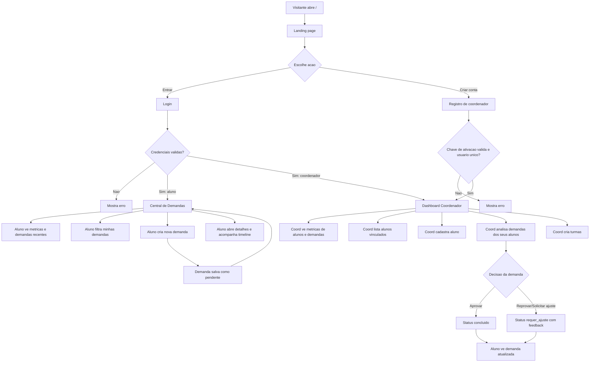
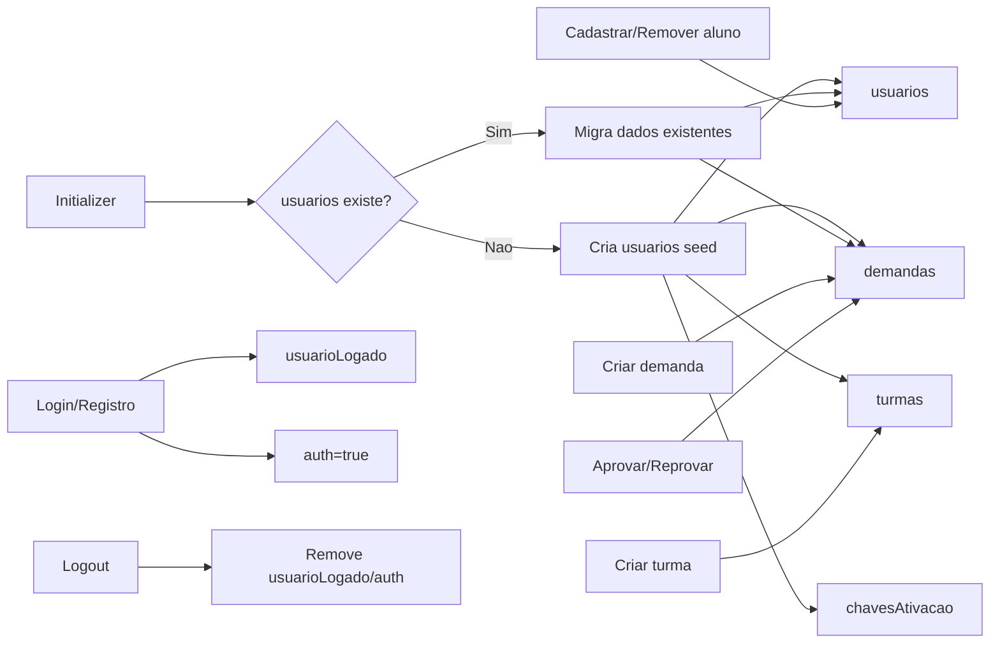

# Resumo do projeto clarify-next

## Visao geral

`clarify-next` e uma aplicacao web feita com Next.js, React, TypeScript e Tailwind CSS. O objetivo do site e oferecer uma plataforma academica para alunos abrirem e acompanharem demandas, enquanto coordenadores gerenciam alunos, demandas e turmas.

A aplicacao usa o App Router do Next.js e guarda os dados no `localStorage` do navegador. Nao ha backend externo neste estado do projeto. Os principais dados persistidos sao usuarios, demandas, turmas, chaves de ativacao e sessao do usuario logado.

## Tecnologias e scripts

- `Next.js 16`: framework da aplicacao.
- `React 19`: construcao da interface.
- `TypeScript`: tipagem das entidades e componentes.
- `Tailwind CSS 4`: estilos utilitarios.
- `lucide-react`: icones usados na UI.

Scripts em `package.json`:

- `npm run dev`: inicia o servidor de desenvolvimento com Next e webpack.
- `npm run build`: gera build de producao.
- `npm run start`: executa a build gerada.
- `npm run lint`: roda ESLint.

## Estrutura de pastas

```text
clarify-next/
|-- public/                  # Imagens e assets servidos publicamente
|-- src/
|   |-- app/                 # Rotas, layouts e paginas Next.js
|   |-- components/          # Componentes reutilizaveis de UI
|   |-- context/             # Contextos globais, principalmente autenticacao
|   |-- hooks/               # Hooks para demandas, usuarios e turmas
|   |-- lib/                 # Regras de dominio, persistencia e utilitarios
|   `-- types/               # Tipos TypeScript compartilhados
|-- node_modules/            # Dependencias instaladas, gerado pelo npm
|-- .next/                   # Build/cache do Next.js, gerado em dev/build
`-- arquivos de configuracao # Next, ESLint, Tailwind, TypeScript, PostCSS
```

## Arquivos da raiz

| Arquivo/Pasta | Funcao |
|---|---|
| `.gitignore` | Define arquivos e pastas ignorados pelo Git, como `node_modules`, `.next`, `.env*`, builds e caches. |
| `AGENTS.md` | Instrucao para agentes de IA sobre a versao do Next.js usada no projeto. |
| `CLAUDE.md` | Referencia `AGENTS.md`; usado como arquivo de instrucao para outra ferramenta/agente. |
| `eslint.config.mjs` | Configura o ESLint com regras do Next.js, Core Web Vitals e TypeScript. |
| `next-env.d.ts` | Arquivo gerado pelo Next.js para tipos globais do framework. |
| `next.config.ts` | Arquivo de configuracao do Next.js; atualmente sem configuracoes customizadas. |
| `node_modules/` | Dependencias instaladas pelo npm. Nao contem regra propria do projeto e nao deve ser editado manualmente. |
| `package-lock.json` | Trava as versoes exatas das dependencias instaladas. |
| `package.json` | Declara scripts, dependencias, devDependencies e metadados do projeto. |
| `PLANEJAMENTO-COMPARACAO.md` | Documento de auditoria comparando o Clarify original com `clarify-next`, incluindo gaps, bugs e plano de acao. |
| `postcss.config.mjs` | Configura PostCSS para usar o plugin do Tailwind CSS. |
| `public/` | Assets estaticos acessiveis por URL publica. |
| `README.md` | README padrao do `create-next-app` com instrucoes basicas de execucao. |
| `src/` | Codigo-fonte da aplicacao. |
| `tailwind.config.ts` | Configura conteudo escaneado pelo Tailwind, cores da marca e fonte principal. |
| `tsconfig.json` | Configura o TypeScript, paths com alias `@/*`, JSX e modo estrito. |
| `tsconfig.tsbuildinfo` | Cache incremental do TypeScript, gerado automaticamente. |
| `.next/` | Cache/build gerado pelo Next.js em desenvolvimento ou producao. |

## Assets em public

| Arquivo | Funcao |
|---|---|
| `public/GATOGORDO.png` | Logo/imagem principal da marca Clarify usada em landing, login, registro, sidebar e topbar. |
| `public/favicon.ico` | Icone do site no navegador. |
| `public/file.svg` | Asset SVG padrao do template Next; disponivel publicamente. |
| `public/globe.svg` | Asset SVG padrao do template Next; disponivel publicamente. |
| `public/next.svg` | Logo do Next.js mantido como asset do template. |
| `public/vercel.svg` | Logo da Vercel mantido como asset do template. |
| `public/window.svg` | Asset SVG padrao do template Next; disponivel publicamente. |

## Arquivos em src/app

| Arquivo | Funcao |
|---|---|
| `src/app/layout.tsx` | Layout raiz. Carrega fonte `Space_Grotesk`, metadados, `AuthProvider`, `Initializer` e `globals.css`. Envolve todas as paginas. |
| `src/app/page.tsx` | Landing page publica. Mostra navbar, hero, preview de demandas, explicacao do fluxo, perfis e CTA para login/registro. |
| `src/app/login/page.tsx` | Tela de login. Le matricula e senha, chama `useAuth().login()` e redireciona alunos para `/centraldemandas` e coordenadores para `/dashboardcoord`. |
| `src/app/registro/page.tsx` | Tela de registro de coordenador. Usa nome, matricula, email, senha e chave de ativacao; chama `useAuth().registro()` e redireciona para o dashboard do coordenador. |
| `src/app/not-found.tsx` | Pagina 404. Exibe erro, permite voltar/home e redireciona automaticamente para `/` apos 10 segundos. |
| `src/app/globals.css` | Estilos globais, import do Tailwind, classes utilitarias customizadas, animacoes, tokens visuais, estilos de modal e timeline. |
| `src/app/favicon.ico` | Favicon dentro da estrutura do App Router. |
| `src/app/(dashboard)/layout.tsx` | Layout protegido dos dashboards. Verifica autenticacao, bloqueia rota por cargo, monta sidebar, topbars e drawer mobile. |
| `src/app/(dashboard)/centraldemandas/page.tsx` | Area do aluno. Mostra inicio, metricas, demandas recentes, filtros, historico, criacao de demanda e modal de detalhes. |
| `src/app/(dashboard)/dashboardcoord/page.tsx` | Area do coordenador. Mostra metricas, alunos vinculados, demandas dos alunos, aprovar/reprovar, cadastrar aluno, criar turmas e detalhes de demanda. |

## Arquivos em src/context

| Arquivo | Funcao |
|---|---|
| `src/context/AuthContext.tsx` | Contexto global de autenticacao. Usa `useSyncExternalStore` para sincronizar usuario logado com `localStorage`; expoe `login`, `logout`, `registro`, `usuario` e `isAuthenticated`. |

## Arquivos em src/hooks

| Arquivo | Funcao |
|---|---|
| `src/hooks/useDemandas.ts` | Hook reativo para listar, criar, buscar, atualizar e filtrar demandas. Usa funcoes de `src/lib/demandas.ts`. |
| `src/hooks/useUsuarios.ts` | Hook reativo para listar usuarios, adicionar, buscar, vincular aluno a coordenador, remover aluno e verificar duplicidade. |
| `src/hooks/useTurmas.ts` | Hook reativo para CRUD local de turmas, adicionar/remover alunos de turmas, contar alunos e filtrar por coordenador. |

## Arquivos em src/lib

| Arquivo | Funcao |
|---|---|
| `src/lib/auth.ts` | Regras de autenticacao e usuarios: login, registro de coordenador, chaves de ativacao, sessao, vinculo coordenador-aluno, exclusao de aluno e logout. |
| `src/lib/demandas.ts` | Regras de demandas: gerar protocolo, criar demanda, buscar por aluno/protocolo/status, listar todas e atualizar status/feedback. |
| `src/lib/localStorage.ts` | Inicializa o banco local com dados seed, cria demandas e turmas iniciais, executa migracoes e permite resetar dados locais. |
| `src/lib/storageMigrations.ts` | Normaliza dados antigos do `localStorage`, compatibilizando campos de usuario e convertendo status legados como `aprovada` e `negada`. |
| `src/lib/utils.ts` | Utilitarios gerais: formatacao de datas, validacoes, labels/cores de status, data atual, limpeza de objeto, concatencao de classes e debounce. |

## Arquivos em src/types

| Arquivo | Funcao |
|---|---|
| `src/types/index.ts` | Define tipos centrais: `Cargo`, `StatusDemanda`, `TipoDemanda`, `Usuario`, `UsuarioLogado`, `Demanda`, `Turma`, `ChaveAtivacao`, respostas de auth e dados de registro. Tambem define `TIPOS_DEMANDA`. |

## Componentes gerais

| Arquivo | Funcao |
|---|---|
| `src/components/Initializer.tsx` | Componente sem UI que roda `popularLocalStorage()` no mount para garantir dados iniciais no navegador. |
| `src/components/ui/Modal.tsx` | Modal base reutilizavel. Controla backdrop, fechamento por ESC, fechamento ao clicar fora e bloqueio de scroll do body. |
| `src/components/ui/index.ts` | Barrel export dos componentes de UI. Atualmente exporta `Modal`. |

## Componentes de layout

| Arquivo | Funcao |
|---|---|
| `src/components/layout/Sidebar.tsx` | Sidebar desktop com navegacao por cargo. Coordenador ve Inicio, Alunos, Adicionar aluno, Demandas e Turmas; aluno ve Inicio e Minhas demandas. |
| `src/components/layout/TopbarDesktop.tsx` | Barra superior desktop com chip do usuario e botao de logout. |
| `src/components/layout/TopbarMobile.tsx` | Barra superior mobile com logo, botao de menu e chip compacto do usuario. |
| `src/components/layout/DrawerMobile.tsx` | Drawer lateral mobile que reutiliza a `Sidebar` e bloqueia scroll quando aberto. |
| `src/components/layout/UserChip.tsx` | Chip com avatar inicial, nome opcional e botao de logout. |
| `src/components/layout/index.ts` | Exportacoes centralizadas dos componentes de layout. |

## Componentes de demandas

| Arquivo | Funcao |
|---|---|
| `src/components/demandas/CardDemanda.tsx` | Card de demanda com protocolo, status, titulo, descricao, datas, feedback e acao de detalhes. |
| `src/components/demandas/CardNovaDemanda.tsx` | Card/botao para abrir o modal de nova solicitacao. |
| `src/components/demandas/BarraFiltros.tsx` | Campo de busca e seletor de status para filtrar demandas. |
| `src/components/demandas/ModalNovaDemanda.tsx` | Modal para o aluno criar demanda com titulo e descricao, validando tamanho minimo e sessao. |
| `src/components/demandas/ModalDetalhesDemanda.tsx` | Modal com detalhes completos da demanda, remetente, status, timeline, datas e feedback. |
| `src/components/demandas/TimelineProgresso.tsx` | Timeline visual do ciclo da demanda: recebida, em analise, resolucao e concluida. |
| `src/components/demandas/EstadoVazio.tsx` | Bloco exibido quando o aluno nao tem solicitacoes. |
| `src/components/demandas/FabMobile.tsx` | Botao flutuante mobile para criar nova solicitacao. |
| `src/components/demandas/CardHistorico.tsx` | Card mobile para demandas concluidas no historico. |
| `src/components/demandas/LinhaHistorico.tsx` | Linha de tabela desktop para demandas concluidas. |
| `src/components/demandas/index.ts` | Exportacoes centralizadas dos componentes de demandas. |

## Componentes de coordenador

| Arquivo | Funcao |
|---|---|
| `src/components/coord/CardAluno.tsx` | Card com dados de aluno, matricula, demandas em aberto e botao opcional para remover aluno. |
| `src/components/coord/CardMetrica.tsx` | Card generico de metrica usado em dashboards. |
| `src/components/coord/CardTurma.tsx` | Card de turma com nome, disciplina, quantidade de alunos e ID. |
| `src/components/coord/ModalCriarTurma.tsx` | Modal para criar turma, informar disciplina e adicionar/remover matriculas antes de salvar. |
| `src/components/coord/ModalFeedback.tsx` | Modal simples para coordenador informar feedback ao reprovar ou solicitar ajuste em uma demanda. |
| `src/components/coord/index.ts` | Exportacoes centralizadas dos componentes de coordenador. |

## Modelo de dados

### Usuario

```ts
type Cargo = 'aluno' | 'coordenador'

interface Usuario {
  nome: string
  matricula: string
  email: string
  senha: string
  cargo: Cargo
  coordenador?: string
  alunosCadastrados?: string[]
  usuariosCadastrados?: string[]
}
```

### Demanda

```ts
type StatusDemanda = 'pendente' | 'em_analise' | 'requer_ajuste' | 'concluido'

interface Demanda {
  protocolo: string
  matriculaAluno: string
  tipo: TipoDemanda
  descricao: string
  status: StatusDemanda
  dataCriacao: string
  dataAtualizacao: string
  feedback: string
}
```

### Turma

```ts
interface Turma {
  id: string
  nome: string
  disciplina: string
  alunos: string[]
  coordenador: string
  criadaEm: string
}
```

## Dados iniciais

Quando o projeto abre no navegador, `Initializer` chama `popularLocalStorage()`. Se ainda nao houver usuarios salvos, sao criados:

| Perfil | Nome | Matricula | Senha | Observacao |
|---|---|---|---|---|
| Coordenador | Joao da Silva | `123` | `123456` | Vinculado aos alunos `003` e `456`. |
| Aluno | Maria Aparecida | `003` | `123456` | Coordenador `123`. |
| Aluno | Carlos Eduardo | `456` | `123456` | Coordenador `123`. |

Tambem sao criadas demandas de teste para a matricula `003`, turmas vazias e chaves de ativacao `123`, `456` e `789` para cadastro de coordenadores.

## Fluxograma dos arquivos do projeto

```mermaid
flowchart TD
    A[Entrada Next.js] --> B[src/app/layout.tsx]
    B --> C[AuthProvider]
    B --> D[Initializer]
    B --> E[globals.css]
    D --> F[lib/localStorage.ts]
    F --> G[storageMigrations.ts]
    F --> H[localStorage do navegador]

    C --> I[AuthContext.tsx]
    I --> J[lib/auth.ts]
    J --> H

    B --> K[Rotas publicas]
    K --> L[src/app/page.tsx]
    K --> M[src/app/login/page.tsx]
    K --> N[src/app/registro/page.tsx]

    M --> I
    N --> I

    B --> O[src/app/(dashboard)/layout.tsx]
    O --> P[components/layout]
    O --> Q[centraldemandas/page.tsx]
    O --> R[dashboardcoord/page.tsx]

    Q --> S[hooks/useDemandas.ts]
    Q --> T[components/demandas]
    S --> U[lib/demandas.ts]
    U --> H

    R --> S
    R --> V[hooks/useUsuarios.ts]
    R --> W[hooks/useTurmas.ts]
    R --> X[components/coord]
    V --> J
    W --> H

    T --> Y[components/ui/Modal.tsx]
    X --> Y
    T --> Z[lib/utils.ts]
    X --> Z
```

## Fluxograma de autenticacao e protecao de rotas

```mermaid
flowchart TD
    A[Usuario acessa o site] --> B{Rota publica ou protegida?}
    B -->|Publica| C[Landing/Login/Registro]
    B -->|Protegida| D[(dashboard)/layout.tsx]

    C --> E{Login ou registro concluido?}
    E -->|Nao| C
    E -->|Sim| F[AuthContext salva usuarioLogado]
    F --> G{Cargo do usuario}
    G -->|aluno| H[/centraldemandas]
    G -->|coordenador| I[/dashboardcoord]

    D --> J{Existe usuario logado?}
    J -->|Nao| K[Redireciona para /login]
    J -->|Sim| L{Cargo combina com a rota?}
    L -->|Sim| M[Renderiza dashboard]
    L -->|Aluno em rota coord| H
    L -->|Coord em rota aluno| I
```

## Fluxograma do comportamento esperado do site



## Comportamento esperado por perfil

### Visitante

- Acessa a landing page em `/`.
- Entende a proposta do Clarify: envio, analise e resolucao de solicitacoes academicas.
- Pode ir para `/login` ou `/registro`.

### Aluno

- Faz login com matricula e senha.
- E redirecionado para `/centraldemandas`.
- Ve uma tela inicial com saudacao, metricas e demandas recentes.
- Pode acessar a view `Minhas demandas` por `?view=demandas`.
- Pode buscar por protocolo ou tipo e filtrar por status.
- Pode criar uma nova demanda com titulo e descricao.
- Pode abrir detalhes da demanda, ver timeline, datas, remetente e feedback.
- Ve demandas concluidas no historico.

### Coordenador

- Faz login com matricula e senha ou cria conta com chave de ativacao.
- E redirecionado para `/dashboardcoord`.
- Ve metricas de alunos vinculados, demandas abertas e percentual de resolucao.
- Pode listar alunos vinculados.
- Pode cadastrar novo aluno e vincula-lo automaticamente a sua coordenacao.
- Pode remover aluno, o que tambem remove suas demandas e referencias em turmas.
- Pode ver demandas dos alunos vinculados.
- Pode aprovar uma demanda, alterando status para `concluido`.
- Pode reprovar/solicitar ajuste, salvando feedback e alterando status para `requer_ajuste`.
- Pode criar turmas com nome, disciplina e matriculas de alunos.

## Fluxo de dados no localStorage



## Observacoes importantes

- O projeto atualmente depende do navegador para persistir dados; limpar o `localStorage` reseta os dados para o seed inicial.
- A protecao de rotas e feita no cliente pelo layout de dashboard, nao por middleware/server-side auth.
- `node_modules/`, `.next/`, `next-env.d.ts` e `tsconfig.tsbuildinfo` sao gerados automaticamente e nao representam regras de negocio do Clarify.
- O arquivo `PLANEJAMENTO-COMPARACAO.md` contem uma analise mais critica da paridade entre a versao original e esta versao Next.js.
