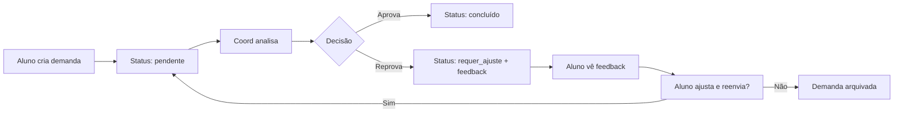
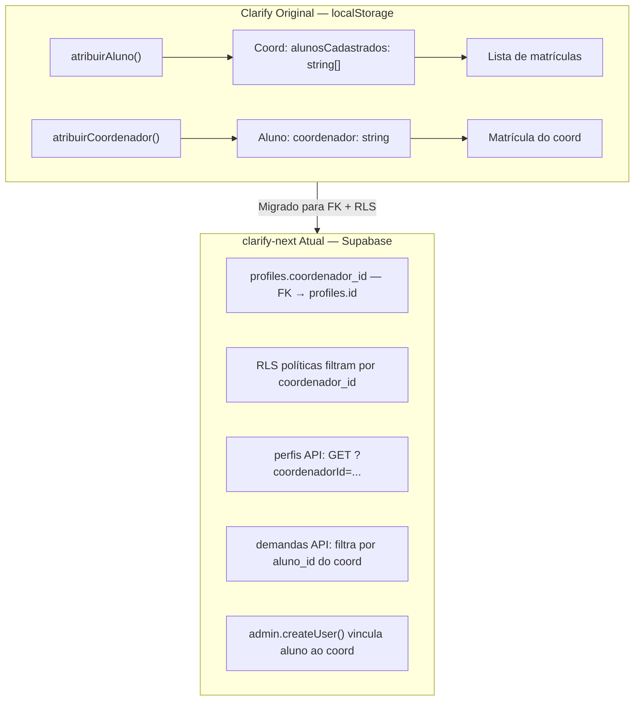
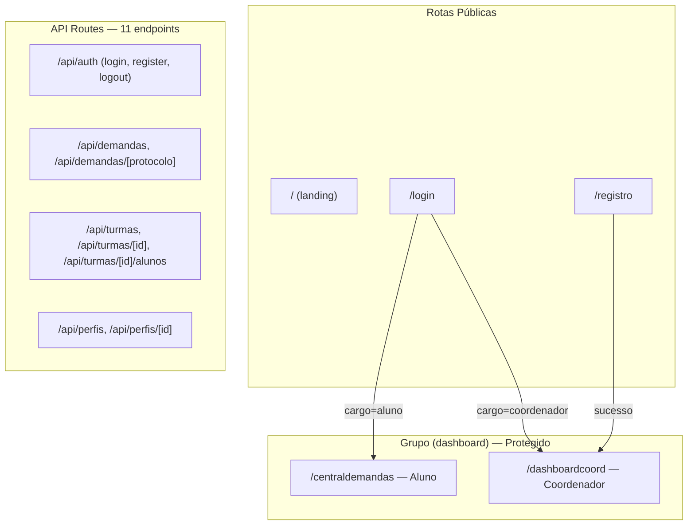
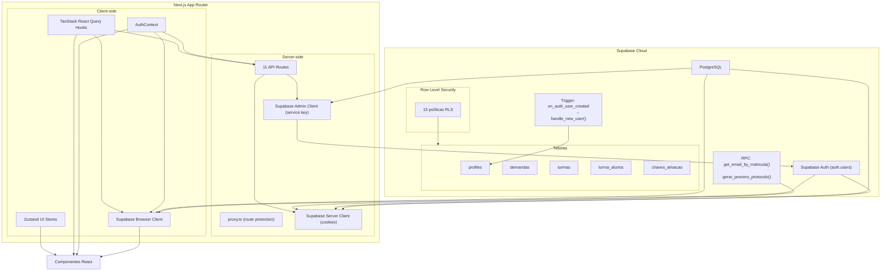

# Diagramas

## 1. Fluxo de Autenticação

```mermaid
flowchart TD
    A[Usuário acessa /login] --> B{Está autenticado?}
    B -->|Sim| C{Qual cargo?}
    B -->|Não| D[Formulário de login]
    D --> E{Credenciais válidas?}
    E -->|Sim| C
    E -->|Não| F[Mostrar erro]
    C -->|aluno| G[/centraldemandas]
    C -->|coordenador| H[/dashboardcoord]
```

## 2. Fluxo de Registro de Coordenador

```mermaid
flowchart TD
    A[/registro] --> B[Preencher formulário]
    B --> C{Chave de ativação válida?}
    C -->|Não| D[Erro: chave inválida]
    C -->|Sim| E[Criar perfil coordenador]
    E --> F[Marcar chave como usada]
    F --> G[Login automático]
    G --> H[/dashboardcoord]
```

## 3. Ciclo de Vida da Demanda



## 4. Modelo de Vínculo Coordenador ↔ Aluno

No Clarify original (localStorage), o vínculo era mantido via arrays no objeto do coordenador. Com a migração para Supabase, o modelo foi normalizado:



## 5. Estrutura de Rotas (App Router)



## 6. Arquitetura de Dados (Supabase)


